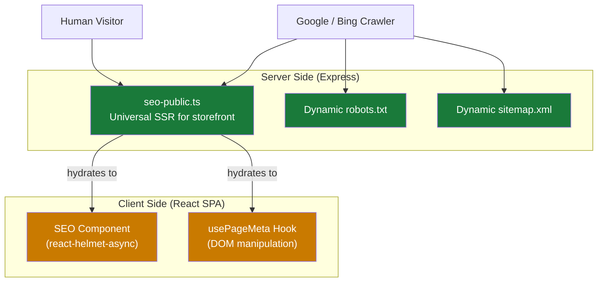

# Nour Platform — Deep SEO Compatibility Evaluation

## Executive Summary

The Nour platform has a **surprisingly strong** SEO foundation — significantly above average for an SPA-based e-commerce platform. The server-side SSR module ([seo-public.ts](file:///c:/proj/nour/artifacts/api-server/src/lib/seo-public.ts)) is the star of the implementation, providing universal server-rendered HTML with full meta tags, structured data, and canonical URLs for all public storefront pages.

However, there are several issues that reduce crawl effectiveness, create duplicate signals, and leave gaps on non-storefront pages. Below is a complete audit organized by severity.

---

## Architecture Overview

The project uses a **dual-layer SEO architecture**:

| Layer | Coverage | Quality |
|-------|----------|---------|
| **Server SSR** ([seo-public.ts](file:///c:/proj/nour/artifacts/api-server/src/lib/seo-public.ts)) | Storefront, products, categories only | ✅ Excellent |
| **Client `<SEO>`** ([seo.tsx](file:///c:/proj/nour/artifacts/fashion-store/src/components/seo.tsx)) | Storefront + product detail | ⚠️ Overlaps with SSR |
| **Client `usePageMeta`** ([use-page-meta.ts](file:///c:/proj/nour/artifacts/fashion-store/src/hooks/use-page-meta.ts)) | Storefront + product detail | ⚠️ Overlaps with SSR and `<SEO>` |
| **Platform pages** (home, pricing, login, etc.) | None (pure SPA) | ❌ No SEO |

---

## ✅ What's Working Well

### 1. Universal SSR for Public Storefronts
The [seo-public.ts](file:///c:/proj/nour/artifacts/api-server/src/lib/seo-public.ts) module serves **full HTML to all visitors** (not just bots), which is the gold-standard approach:

- Store homepage: `OnlineStore` + `BreadcrumbList` JSON-LD
- Product pages: `Product` + `Offer` + `BreadcrumbList` JSON-LD  
- Category pages: `CollectionPage` + `ItemList` + `BreadcrumbList` JSON-LD
- Inline critical CSS for instant first paint
- SPA bundle attached for client-side hydration
- API data preloaded via `<link rel="preload">`

### 2. Dynamic robots.txt & sitemap.xml
Generated at runtime from the database — includes all active stores, products, and categories. Properly blocks admin/API routes.

### 3. Canonical URLs with Custom Domain Support
Canonical URLs correctly point to verified custom domains when available. Tested in [seo-public.test.ts](file:///c:/proj/nour/artifacts/api-server/src/test/seo-public.test.ts).

### 4. Full Open Graph + Twitter Cards (SSR layer)
The `renderDocument()` function emits a complete set: `og:type`, `og:title`, `og:description`, `og:image`, `og:url`, `og:locale`, `og:site_name`, `twitter:card`, `twitter:title`, `twitter:description`, `twitter:image`.

### 5. Proper Caching Headers
- Storefront pages: `Cache-Control: public, max-age=60, s-maxage=300` (CDN-friendly)
- robots.txt: 24h cache
- sitemap.xml: 1h cache

### 6. SEO-Friendly URLs
Product and category URLs use `{id}-{slug}` format (e.g., `/product/42-فستان-أحمر`) — both machine-parseable and human-readable.

### 7. Image SEO
- Product images use `alt={product.name}` consistently
- LCP images get `fetchpriority="high"` and `loading="eager"`
- Explicit `width` and `height` to prevent CLS

### 8. Test Coverage
The [test suite](file:///c:/proj/nour/artifacts/api-server/src/test/seo-public.test.ts) validates: SSR HTML output, hidden product exclusion, canonical URLs, JSON-LD schemas, sitemap content, and robots.txt blocking.

---

## 🔴 Critical Issues

### 1. Duplicate/Triple Meta Tag Injection on Storefront & Product Pages

> [!CAUTION]
> Both [storefront.tsx](file:///c:/proj/nour/artifacts/fashion-store/src/pages/storefront.tsx) and [product-detail.tsx](file:///c:/proj/nour/artifacts/fashion-store/src/pages/product-detail.tsx) use **three** SEO systems simultaneously:
> 1. Server-side SSR (meta tags in initial HTML)
> 2. `<SEO>` component via react-helmet-async
> 3. `usePageMeta` hook via direct DOM manipulation

**Impact**: After hydration, the page can end up with **duplicate** `<meta>` tags, **duplicate** JSON-LD `<script>` tags, and potentially conflicting canonical URLs. Google may see:
- 2-3 `og:title` tags with different values
- 2-3 JSON-LD blocks (one with `OnlineStore`, another with `Store`, another with `Product`)
- The `<SEO>` component uses `og:site_name="Nour Platform"` while `usePageMeta` uses `"نور"` and SSR uses `"نــور"` — three different site names

**Fix**: The client-side should detect `window.__NOUR_INITIAL_PUBLIC_PAGE__` and skip `<SEO>` + `usePageMeta` entirely when SSR has already injected proper meta tags. Or consolidate into a single system.

---

### 2. Platform Marketing Pages Have Zero SEO

> [!WARNING]
> The platform's public-facing marketing pages are **completely invisible to search engines**:

| Page | Title Tag | Meta Desc | OG Tags | JSON-LD | Canonical |
|------|-----------|-----------|---------|---------|-----------|
| [home.tsx](file:///c:/proj/nour/artifacts/fashion-store/src/pages/home.tsx) | ❌ None | ❌ None | ❌ None | ❌ None | ❌ None |
| [pricing.tsx](file:///c:/proj/nour/artifacts/fashion-store/src/pages/pricing.tsx) | ❌ None | ❌ None | ❌ None | ❌ None | ❌ None |
| [not-found.tsx](file:///c:/proj/nour/artifacts/fashion-store/src/pages/not-found.tsx) | ❌ None | ❌ None | — | — | — |

These pages are served as pure SPA with only the default `<title>` from [index.html](file:///c:/proj/nour/artifacts/fashion-store/index.html). Since they're not covered by the SSR module, crawlers see an empty shell.

**For the homepage**, this means the main landing page for the Nour brand (`nour.eg`) has **no SEO presence** — a severe gap for acquiring merchants.

---

### 3. 404 Page Returns HTTP 200

> [!WARNING]
> The [not-found.tsx](file:///c:/proj/nour/artifacts/fashion-store/src/pages/not-found.tsx) page renders a visual "404" but the server responds with **HTTP 200**. It also lacks `<meta name="robots" content="noindex">`.

**Impact**: Google will index 404 pages as legitimate content, diluting crawl budget and causing soft-404 penalties.

**Fix**: Either add a server-side route that returns HTTP 404 for unmatched paths, or at minimum add `noindex` via Helmet.

---

### 4. Admin Pages Lack `noindex` Protection

> [!IMPORTANT]
> Dashboard pages (`/dashboard`, `/orders`, `/products`, `/analytics`, etc.) have **no `<meta name="robots" content="noindex">`** tag. While they're behind authentication and blocked in `robots.txt`, `robots.txt` is advisory — Google may still crawl and index them if linked from anywhere.

---

## 🟡 Moderate Issues

### 5. No `hreflang` Tags Despite ar/en i18n Support

The app supports Arabic and English via [i18n.ts](file:///c:/proj/nour/artifacts/fashion-store/src/lib/i18n.ts), but:
- SSR HTML is hardcoded to `<html lang="ar">`
- No `<link rel="alternate" hreflang="ar" href="...">` / `hreflang="en"` tags
- OG locale is hardcoded to `ar_EG`

**Impact**: Google cannot discover the English version of pages, and may serve Arabic content to English-speaking users.

### 6. Missing `og:image` Dimensions

The `og:image` tag is emitted but `og:image:width` and `og:image:height` are missing. Facebook/WhatsApp/Twitter may display a generic placeholder while loading the image, or may not display it at all if the URL is slow to respond.

### 7. Product Schema Missing Recommended Properties

The Product JSON-LD in [seo-public.ts:534-566](file:///c:/proj/nour/artifacts/api-server/src/lib/seo-public.ts#L534-L566) is good but missing Google's recommended fields:

| Field | Status | Impact |
|-------|--------|--------|
| `sku` | ❌ Missing | Reduced rich result eligibility |
| `gtin` / `mpn` | ❌ Missing | Lower product snippet priority |
| `aggregateRating` | ❌ Missing (SSR) | No star ratings in SERPs |
| `review` | ❌ Missing (SSR) | No review snippets |
| `brand` | ❌ Missing (SSR) | Reduced brand association |
| `condition` | ❌ Missing | Item condition not indicated |

> Note: The client-side `usePageMeta` in product-detail.tsx does include `aggregateRating` when reviews exist, but this is JS-rendered and not in the SSR output.

### 8. Sitemap Uses `createdAt` Instead of `updatedAt` for `<lastmod>`

In [seo-public.ts:829](file:///c:/proj/nour/artifacts/api-server/src/lib/seo-public.ts#L829), `<lastmod>` uses `createdAt` which never changes. Google relies on accurate `<lastmod>` to prioritize recrawling — using `createdAt` makes the sitemap less useful.

### 9. No Sitemap Index for Large Catalogs

The sitemap is a single XML file. Google recommends a maximum of 50,000 URLs per sitemap file. As the platform grows with many tenants, this will need a sitemap index with split files.

### 10. Default `index.html` Has No Meta Description

The [index.html](file:///c:/proj/nour/artifacts/fashion-store/index.html) template has a `<title>` but **no `<meta name="description">`**. Any page not covered by SSR or client-side meta injection will have no search snippet.

### 11. `og:site_name` Inconsistency

Three different values are used across the codebase:
- SSR: `"نــور"` (with decorative Unicode characters)
- `usePageMeta`: `"نور"`
- `<SEO>` component: `"Nour Platform"`

---

## 🟢 Minor / Low Priority Issues

### 12. No `<meta name="theme-color">` in HTML
Only set in the PWA manifest, not in the `<head>`. Affects browser tab styling.

### 13. Missing `srcset` for Responsive Images
Product images use fixed `width`/`height` but no `srcset` for different screen densities. Affects mobile Core Web Vitals (LCP).

### 14. No Structured Data for Homepage
The platform homepage could benefit from `Organization` or `WebSite` schema with `SearchAction` (sitelinks search box).

### 15. Font Loading Strategy
Google Fonts are loaded via a render-blocking `<link>` in the `<head>`. Consider `font-display: swap` (already set via `&display=swap`) — good, but a `preload` for the primary font weight would improve LCP.

### 16. `maximum-scale=1` in Viewport Meta
The viewport tag includes `maximum-scale=1` which prevents zooming. Google flags this as an accessibility issue that can indirectly affect SEO rankings.

---

## Scorecard Summary

| Category | Score | Notes |
|----------|-------|-------|
| **Crawlability** | ★★★★☆ | SSR for storefronts is excellent; platform pages are SPA-only |
| **Structured Data** | ★★★★☆ | Rich JSON-LD for stores/products/categories; missing reviews/brand in SSR |
| **Meta Tags** | ★★★☆☆ | Complete on SSR pages; duplicate injection issue; missing on platform pages |
| **Canonical URLs** | ★★★★★ | Excellent — custom domain support, proper URL normalization |
| **Open Graph / Social** | ★★★★☆ | Full OG + Twitter on SSR; inconsistent site_name; missing image dimensions |
| **robots.txt / Sitemap** | ★★★★☆ | Dynamic, database-driven; `lastmod` uses `createdAt`; no sitemap index |
| **i18n / hreflang** | ★☆☆☆☆ | Two languages supported but no hreflang implementation |
| **Image SEO** | ★★★★☆ | Good alt text; `fetchpriority` used; missing `srcset` |
| **Core Web Vitals** | ★★★★☆ | Inline critical CSS; lazy loading; font preconnect; no `srcset` |
| **Test Coverage** | ★★★★☆ | Key SSR scenarios covered; no test for duplicate meta, platform pages |

**Overall: 7.5/10** — Strong storefront SEO, but platform pages, duplication, and hreflang gaps hold it back.

---

## Prioritized Recommendations

### Tier 1 — High Impact, Should Fix

1. **Consolidate client-side SEO to avoid duplication** — Skip `<SEO>` + `usePageMeta` when `__NOUR_INITIAL_PUBLIC_PAGE__` is present
2. **Add SEO meta tags to platform marketing pages** — home.tsx and pricing.tsx need `usePageMeta` or `<SEO>`
3. **Add `noindex` to 404 and admin pages** — Prevent index pollution
4. **Add `aggregateRating` and `brand` to SSR Product JSON-LD** — Enable rich result eligibility

### Tier 2 — Medium Impact

5. **Implement `hreflang`** — Add `<link rel="alternate">` tags for `ar` and `en`
6. **Fix sitemap `<lastmod>` to use `updatedAt`** — Improve recrawl accuracy
7. **Add `og:image:width`/`og:image:height`** — Fix social preview rendering
8. **Standardize `og:site_name`** — Pick one value across all layers
9. **Add default `<meta name="description">` to index.html** — Safety net for uncovered pages

### Tier 3 — Nice to Have

10. **Add `Organization`/`WebSite` schema to homepage** — Sitelinks search box
11. **Implement `srcset` for product images** — Mobile LCP optimization
12. **Add sitemap index support** — Scalability for large catalogs
13. **Remove `maximum-scale=1`** — Accessibility and indirect SEO benefit
14. **Add `<meta name="theme-color">` to HTML** — Browser UI consistency
